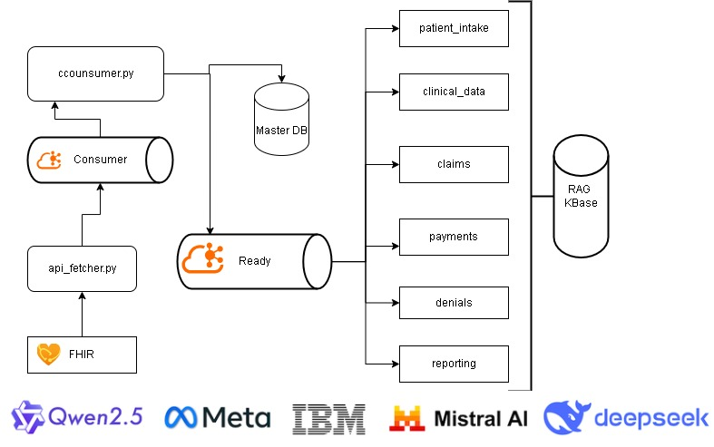

# FHIR Revenue Cycle Management System (MVP)

## Overview

The **FHIR Revenue Cycle Management (RCM) System** is a modular and scalable platform designed to streamline healthcare data processing and revenue cycle management. It leverages Kafka for event-driven architecture, MongoDB for data storage, and integrates with LLMs (Large Language Models) for advanced data processing and insights.

This repository represents the **Minimum Viable Product (MVP)** of the system, located in the `basic-fhir-rcm-setup` folder. The MVP demonstrates the core functionality of the system, including data ingestion, processing, and storage.

---

## Architecture

The system is built as a series of **processors** that:
1. **Ingest Input**: Data is ingested from external sources (e.g., FHIR APIs).
2. **Process Data**: Data is processed, often utilizing LLMs for advanced analysis.
3. **Produce Output**: Results are stored in MongoDB or sent to Kafka topics for downstream processing.

### Key Components
- **Kafka**: Event-driven messaging backbone for real-time data streaming.
- **MongoDB**: NoSQL database for storing healthcare data.
- **LLMs**: Used for natural language processing and summarization tasks.
- **FHIR APIs**: Integration with FHIR-compliant APIs for healthcare data exchange.

---

## Folder Structure

```
basic-fhir-rcm-setup/
│
├── docker-compose.yml         # Docker Compose for Kafka and MongoDB setup
├── mongo_data/                # MongoDB persistent data storage
├── kafka_data/                # Kafka persistent data storage
├── app/                       # Application logic
│   ├── producers.py           # Kafka producers for sending messages
│   ├── consumers.py           # Kafka consumers for processing messages
│   └── api_fetcher.py         # Fetches FHIR data from external APIs
```

---

## Features

### 1. **Data Ingestion**
- Fetch FHIR-compliant patient data using the `api_fetcher.py` script.
- Send the data to Kafka topics for processing.

### 2. **Event-Driven Processing**
- Kafka producers and consumers handle real-time data streaming.
- Consumers process messages and store results in MongoDB.

### 3. **Scalable Architecture**
- Modular design allows for easy integration of additional processors.
- Built-in support for LLMs to enhance data processing capabilities.

---

## Getting Started

### Prerequisites
- Docker and Docker Compose installed on your system.

### Steps to Run the MVP
1. Clone the repository:
   ```bash
   git clone https://github.com/yourusername/fhir-rcm-system.git
   cd fhir-rcm-system/basic-fhir-rcm-setup
   ```
2. Start the services using Docker Compose:
   ```bash
   docker-compose up -d
   ```
3. Run the application scripts:
   - Fetch FHIR data and send to Kafka:
     ```bash
     python app/api_fetcher.py
     ```
   - Consume Kafka messages and store in MongoDB:
     ```bash
     python app/consumers.py
     ```

---

## Enhanced Features and Future Directions

The current MVP lays a strong foundation for efficient healthcare data processing and revenue cycle management. To further enhance its capabilities, we plan to integrate advanced AI-driven features:

### Advanced Clinical Intelligence and Reporting
* **AI-Driven Clinical Workflow Automation**:
    * We aim to implement a sophisticated multi-agent system to automate complex clinical workflows and generate insightful reports. This will include specialized agents such as:
        * **Clinical Coordinator**: To orchestrate diagnostic processes and synthesize findings, acting as a central point for clinical information.
        * **Disease Specialist**: To provide in-depth analysis of specific conditions, like viral diseases or internal medicine cases.
        * **Medical Coding Specialist**: To ensure accurate and efficient medical coding, including automated ICD-10 assignments.
        * **Diagnostic Synthesis Agent**: To integrate and summarize diagnostic data for comprehensive assessments.
        * **Imaging Analyst**: To analyze radiological images and provide detailed reports.
* **Streamlined Data Integration**:
    * To facilitate seamless data flow and analysis, we will implement:
        * RAG (Retrieval-Augmented Generation) API support for enhanced information retrieval from medical knowledge bases.
        * Robust logging and telemetry for comprehensive system monitoring and debugging.
        * Scalable batch processing capabilities to handle large volumes of medical data.
        * Configurable output formats and storage options to meet diverse clinical and reporting needs.
* **Automated Medical Coding and Clinical Documentation**:
    * To improve efficiency and accuracy in clinical documentation and coding, we will develop features for:
        * **Automated ICD-10 Code Assignment**: To streamline the coding process and ensure compliance.
        * Hierarchical Condition Category (HCC) coding for risk adjustment.
        * Generation of evidence-based diagnostic rationales to support clinical decision-making.
        * Creation of detailed clinical progression timelines for patient tracking and analysis.

These planned enhancements are designed to leverage AI and advanced data processing to transform medical data into actionable insights, ultimately improving patient care and streamlining clinical workflows.

---

## Future Enhancements

- **LLM Integration**: Add advanced natural language processing for summarization and insights.
- **Additional Processors**: Expand the system to include billing, claims, and reporting modules.
- **Visualization**: Build dashboards for real-time monitoring and analytics.

---
### Analytics Layer Foundation

* **Tuva Health Integration**:
    * We plan to leverage **The Tuva Project** ([https://github.com/tuva-health/tuva](https://github.com/tuva-health/tuva)) as the foundational layer for our data marts and quality checks within the analytics layer. This integration will significantly simplify reporting and BI visualization by providing:
        * Pre-built data marts tailored for healthcare analytics.
        * Automated data quality checks to ensure data integrity and reliability.
        * A robust framework for building analytical dashboards and visualizations.
---
